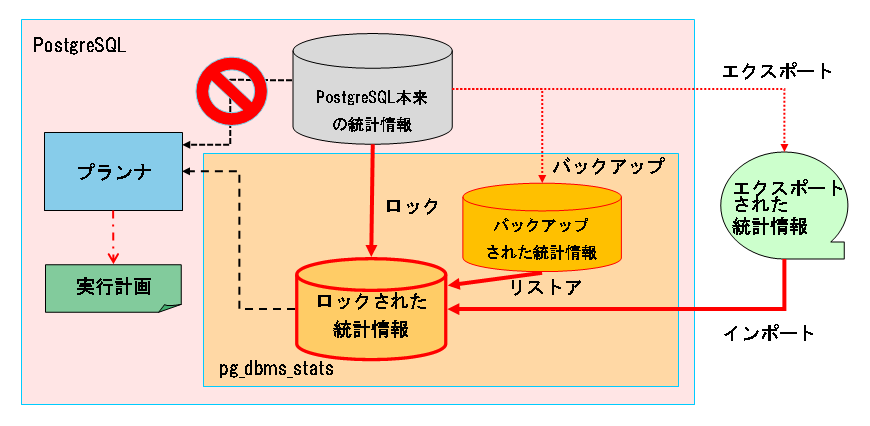

------------------------------------------------------------------------

1.  [名前](#名前)
2.  [概要](#概要)
3.  [機能説明](#機能説明)
4.  [インストール](#インストール)
5.  [アンインストール](#アンインストール)
6.  [使用例](#使用例)
7.  [使用上の注意と制約](#使用上の注意と制約)
8.  [詳細](#詳細)
9.  [動作環境](#動作環境)
10. [関連項目](#関連項目)
11. [Appendix A. オブジェクト一覧](objects-ja.md)

# pg_dbms_stats 14.0

## 名前

pg_dbms_stats -- 統計情報の管理を行い、間接的に実行計画を制御します。

## 概要

PostgreSQL は ANALYZEコマンドによりテーブルやインデックスからサンプリングした値を集計して統計情報として保持しています。
クエリ・オプティマイザは、この統計情報を利用してクエリのコストを計算し、最もコストの低い実行計画を選択します。このため、データの量や特性が変化したり、統計情報の精度が不十分であったりした場合には、選択される実行計画が変化する場合があります。

pg_dbms_statsパッケージはこのような予期せぬ実行計画の変化を防ぐための機能拡張です。プランナの処理に割り込んで、プランナが参照する統計情報を事前に作成したダミー統計情報に差し替えることで、選択される統計情報を固定します。「実行計画が運用中に急に変化し、システムの性能が低下する」というリスクを抑えたい場合に有効です。

pg_dbms_statsが統計情報を固定できるのオブジェクトは以下のとおりです。

-   通常のテーブル
-   インデックス(式インデックス以外は一部制限あり)
-   外部テーブル(PG9.2以降)
-   マテリアライズドビュー

## 機能説明

pg_dbms_statsには、プランナが使用する統計情報を操作する機能として以下の8つがあります。なお、エクスポートを除く各機能は、SQL関数経由で利用します。各関数の詳細は[オブジェクト一覧](objects-ja.md)を参照してください。

### バックアップ

概要  
- 現在選択されている実行計画を将来的に再現するために、現在プランナが見ている統計情報をバックアップとして保存します。

利用方法  
- backup_<オブジェクト単位>_stats()というSQL関数を実行

詳細  
- バックアップに含める統計情報の範囲は、データベース(現在接続中のもの)・スキーマ・テーブル・列のいずれかの単位で指定できます。例えばあるスキーマに含まれている全ての表とそれらの全ての列の統計情報を保存しておきたい場合は、スキーマ単位でバックアップします。基本的にはデータベース単位またはスキーマ単位などの大き目の単位でバックアップしておくことをお勧めします。

- 現在保存されているバックアップに関する情報は、dbms_stats.backup_historyテーブルで参照できます。dbms_stats.backup_historyテーブルの詳細については[テーブル](objects-ja.md#テーブル)を参照してください。

### リストア

概要  
- バックアップ時点で選択されていた実行計画が再び選択されるように、バックアップした統計情報を復元して固定します。

利用方法  
- restore_stats()、またはrestore_<オブジェクト単位>_stats()というSQL関数を実行

詳細  
- リストア時に指定したオブジェクト以外の統計情報以外は変更されず元のまま残ります。リストアするバックアップ統計情報の指定方法は、以下の二種類があります。

    - バックアップID  
        - restore_stats()という関数にバックアップIDを指定して実行することで、そのIDを持つバックアップに含まれる統計情報を全てリストアします。データベースやスキーマ単位でバックアップを定期的に取得する運用の場合は、この指定方法が単純でよいでしょう。なお、バックアップIDはデータベースごとに一意になっていますので、複数データベースでpg_dbms_statsを利用している場合は、他のデータベースのバックアップIDと混同しないように注意してください。
    - オブジェクト＋タイムスタンプ  
        - restore_<オブジェクト単位>_stats()オブジェクト(データベース、スキーマ、テーブル、列のいずれか)を指定して実行することで、それに含まれる全ての列と表の統計情報を、指定したタイムスタンプ時点の状態にリストアします。ただし、指定するタイムスタンプより前にリストアするよりも広い範囲のバックアップを取得してあることが前提です。  
    - ある時点までは適切な実行計画が選択されていたことが分かっているが、バックアップを細かい単位で取得していてどれをリストアすればよいか分からない、という場合はこの指定方法が便利です。

リストアした時点で統計情報はバックアップした時点のもので固定されていますので、リストア後に明示的にロックする必要はありません。

### パージ

概要  
- 不要になった統計情報バックアップを一括削除する機能で、指定したバックアップID以前のバックアップを削除します。

利用方法  
- purge_stats()というSQL関数を実行

詳細  
- 基本的には任意世代以前のバックアップを削除できますが、不用意にバックアップを削除してしまうことを防ぐために、パージ後にデータベース単位のバックアップがひとつも残らない状況での一括削除はできません。この制限は、ユーザが強制削除を指定することで回避可能です。

### ロック

概要  
- ANALYZEを実行して統計情報が変化しても現在選択されている実行計画が選択され続けるように、プランナが参照する統計情報を固定します。

利用方法  
- lock_<オブジェクト単位>_stats()というSQL関数を実行

詳細  
- 統計情報をロックする範囲は、データベース(現在接続中のもの)・スキーマ・テーブル・列のいずれかの単位で指定できます。

### ロック解除

概要  
- PostgreSQL本来の実行計画選択基準に戻すために、統計情報の固定状態を解除します。

利用方法  
- unlock_<オブジェクト単位>_stats()というSQL関数を実行

詳細  
- ロックを解除すると、プランナがpg_classやpg_statisticを参照するようになります。統計情報のロックを解除する範囲は、データベース(現在接続中のもの)・スキーマ・テーブル・列のいずれかの単位で指定できます。なお、ロックと異なる単位を指定してロック解除することも可能です。

### クリーンアップ

概要  
- すでに存在しないオブジェクトの統計情報を削除します。

利用方法  
- clean_up_stats()というSQL関数を実行

詳細  
- ロックを解除せずに列やテーブルを削除すると、使用しないダミー統計情報が残ります。このダミー統計情報を一括削除します。

### エクスポート

概要  
- 現在の統計情報を外部ファイルに出力します。

利用方法  
- エクスポート対象別のサンプルSQLファイル(export_<種別\>_stats-<PGバージョン>.sql.sample)を参考にCOPY文を作成し、psqlコマンドなどで実行

詳細  
- 用途に応じて、以下の二種類の統計情報をエクスポートできます。なお、エクスポートにはCOPYコマンドを使用するので、エクスポートファイル出力先ディレクトリにはPostgreSQL実行ユーザでファイルを作成できるディレクトリを指定してください。

    - PostgreSQL本来の統計情報  
        - pg_classやpg_statisticといったPostgreSQLが元々持っている統計情報で、pg_dbms_statsがインストールされていない本番運用環境から検証環境などの別環境に統計情報をコピーして、解析やチューニングを実行する場合に向いています。
    - 現在有効な統計情報  
        - ロックやリストア、インポートなどによって作成された、pg_dbms_statsが現在プランナに見せている統計情報です。pg_dbms_statsが有効な環境で統計情報を編集してチューニングした後にその統計情報を本番環境に戻す場合や、統計情報のバックアップをOSファイルで保存しておきたい場合などに向いています。
    - サンプルファイルは、「pg_config --docdir」で表示されるディレクトリにあるextensionサブディレクトリにインストールされています。

### インポート

概要  
- エクスポート機能で作成した外部ファイルから統計情報を読み込み、プランナが参照する統計情報として固定します。

利用方法  
- import_<オブジェクト単位>_stats()というSQL関数を実行

詳細  
- インポートする統計情報の範囲は、データベース(現在接続中のもの)・スキーマ・テーブル・列のいずれかの単位で指定できます。インポートするファイルは、PostgreSQL実行ユーザが読み取れるディレクトリに配置してください。

## インストール

pg_dbms_stats のインストール方法は、標準の拡張(EXTENSION)と同様です。

### ビルド

makeを使ってビルドできます。PostgreSQLをインストールしたOSユーザでインストールしてください。
このとき、pg_configでビルドに必要な情報を収集しますので、複数バージョンがインストールされた環境では
PATH 環境変数に注意して下さい。

    $ cd pg_dbms_stats
    $ make
    $ su
    # make install

### データベースへの登録

pg_dbms_stats は PostgreSQLの拡張(EXTENSION)ですので、この機能を利用するデータベースにスーパーユーザで接続して
CREATE EXTENSION コマンド を実行してください。

コマンドの例を以下に示します。
*dbname*は対象となるデータベース名を意味します。

    $ psql -d dbname -c "CREATE EXTENSION pg_dbms_stats"

登録解除は DROP EXTENSION コマンドで可能です。登録を解除しても
dbms_stats スキーマはそのまま残りますので、必要に応じて削除して下さい。

### pg_dbms_statsのロード

pg_dbms_statsを有効にするには、以下の例のようにpg_dbms_statsの共有ライブラリをロードしてください。
全てのセッションでpg_dbms_statsを有効にするには、postgresql.confのshared_preload_libraries
GUCパラメータに'pg_dbms_stats'を追加してから設定をリロードして下さい。

    postgres=# LOAD 'pg_dbms_stats';
    LOAD
    postgres=#

**注意**: pg_dbms_stats
を[データベースに登録](#データベースへの登録)せずに、モジュールだけをロードしている場合は、任意のSQL文の実行の際に以下に示す例のようなエラーとなります。
pg_dbms_statsを使うときは、データベースへの登録を忘れないように注意してください。

    test=# SELECT * FROM test;
    ERROR:  schema "dbms_stats" does not exist
    LINE 1: SELECT relpages, reltuples, curpages  FROM dbms_stats.relati...
                                                       ^
    QUERY:  SELECT relpages, reltuples, curpages  FROM dbms_stats.relation_stats_locked WHERE relid = $1
    test=#

### pg_dbms_statsの無効化

pg_dbms_statsをロードしたうえで無効にしたい場合は、以下の例のようにpg_dbms_stats.use_locked_statsをoffに設定してください。

    test=# SET pg_dbms_stats.use_locked_stats TO off;
    SET
    test=# SELECT * FROM test; -- 通常の基準でプランを作成
    ...
    test=# SET pg_dbms_stats.use_locked_stats TO on;
    SET
    test=# SELECT * FROM test; -- ダミー統計情報でプランを作成
    ...

全てのセッションでpg_dbms_statsを無効にするには、postgresql.confでpg_dbms_stats.use_locked_statsをoffに設定してから設定をリロードしてください。PG9.4以降ではALTER SYSTEM が利用可能です。

## アンインストール

pg_dbms_statsをアンインストールするときは、以下の手順を実行してください。
*dbname*は対象となるデータベース名を意味します。

1.  pg_dbms_statsをインストールしたOSユーザでmake
    uninstallを実行してください。
2.  pg_dbms_statsを登録したデータベースにスーパーユーザで接続して DROP
    EXTENSION コマンドを実行してください。
3.  pg_dbms_stats
    独自の統計情報(ロック機能やバックアップ機能で保存したもの)が必要ない場合は、dbms_statsスキーマを削除してください。

## 使用例

大きく分けて「バックアップ主体」「ロック主体」「エクスポート主体」の3つの運用方法があります。
どの運用方法が適しているか判断できない場合には、まず「バックアップ主体」で運用することをお奨めします。

### 統計情報をバックアップする運用

サービス運用中に統計情報を日々バックアップし、問題が生じたらリストアする場合には
backup_xxx() と restore_xxx() 関数を使用します。
特に問題がない限り、データベース単位でバックアップしてください。

統計情報をリストアする方法は、バックアップ世代を表すバックアップIDを指定する方法と、どの時点の統計情報に復元するかを表すタイムスタンプを指定する方法の2種類です。
バックアップIDを指定してリストアする場合、
バックアップIDが一致するデータを使ってリストアします。
リストアしたいバックアップ世代のIDを指定してリストアしてください。
タイムスタンプを指定してリストアする場合、
オブジェクトごとに、指定した日時以前のバックアップデータを使ってリストアします。
リストアしたい日時を指定してデータベース単位でリストアしてください。
特に問題がない限り、バックアップIDを指定する方法でリストアしてください。

    -- 日々バックアップを取り、その後 ANALYZE する。
    test=# SELECT dbms_stats.backup_database_stats('comment');
     backup_database_stats
    -----------------------
                         1
    (1 row)

    test=# ANALYZE;
    ANALYZE
    test=#

    -- 1日前のバックアップを書き戻し、その値でロックする。
    test=# SELECT dbms_stats.restore_database_stats(now() - '1 day');

**注意**:
タイムスタンプを指定してリストアする場合、リストア対象のオブジェクトに含まれるテーブルや列それぞれについて、指定したタイムスタンプ以前で最新の統計情報をリストアします。
このため、単位の小さなオブジェクトでバックアップしていたとき、指定したタイムスタンプ以前にバックアップしていないテーブルや列の統計情報はリストアされず、統計情報がユーザの想定通りにならない場合がありますので注意してください。

統計情報バックアップデータをリストアしたときの例を以下に示します。
なお、time列は各テーブルの統計情報をバックアップした時のタイムスタンプを意味します。

    test=# SELECT b.id, b.time, r.relname
         FROM dbms_stats.relation_stats_backup r
         JOIN dbms_stats.backup_history b ON (r.id=b.id)
        ORDER BY id;
     id |          time          |     relname
    ----+------------------------+-----------------
      4 | 2012-01-01 00:00:00+09 | public.droptest
      5 | 2012-01-02 12:00:00+09 | public.test
    (5 rows)

    test=# SELECT dbms_stats.restore_database_stats('2012-01-03 00:00:00+09');
     restore_database_stats
    ------------------------
     test
     droptest
    (2 rows)

    test=#

### 統計情報をロックする運用

サービス開始時に統計情報をロックして、そのまま運用する場合には、lock_xxx()関数を使用します。

    test=# SELECT dbms_stats.lock_database_stats();
     lock_database_stats
    ---------------------
     droptest
     test
    (2 rows)

    test=#

### 統計情報をエクスポートする運用

サービス運用中の統計情報をエクスポートし、他のデータベースにインポートすることで実行計画を再現したい場合には、export_xxx_stats-.sql_sampleファイルを参考に作成したCOPY文でエクスポートし、import_xxx()関数でインポートします。

    $ cd pg_dbms_stats
    $ psql -d test -f export_effective_stats-9.1.sql
    BEGIN
    COMMIT
    $ psql -d test2 -c "SELECT dbms_stats.import_database_stats('$PWD/export_stats.dmp')"
     import_database_stats
    -----------------------

    (1 row)

    $

**注意**:
統計情報をエクスポートするとき、現在のパスにexport_stats.dmpファイルを作成します。
このとき、同名のファイルが既に存在する場合、新しいエクスポート結果で上書きします。
上書きを避けたい場合は、既存のファイル名を変更するなどして対応してください。  
また、統計情報をインポートするときに指定する情報は、対象となるファイルの絶対パスです。
相対パスを指定すると以下に示す例のようなエラーとなりますので注意してください。

    test=# select dbms_stats.import_database_stats('export_stats.dmp');
    ERROR:  relative path not allowed for dbms_stats_export to file
    test=#

また、エクスポートファイルにはCOPYのバイナリフォーマットを利用しているため、エクスポート元とインポート先でアーキテクチャやPostgreSQLバージョンに差がある場合は正常に動作しない場合があります。詳しくは、[COPYコマンドのドキュメント](http://www.postgresql.jp/document/current/html/sql-copy.html)を参照して下さい。

## 使用上の注意と制約

pg_dbms_stats を使用する際には、以下の使用上の注意と制約があります。

利用前に必要な作業  
- pg_dbms_statsのロック機能やバックアップ機能を使用する前に、必ず一回はANALYZEコマンドで統計情報を取得してください。統計情報が存在しない状態でロックやバックアップを実行した場合、エラーは発生しませんが実行計画は制御できません。

統計情報の固定に関するオブジェクトの制限  
- 式インデックスではない通常のインデックスは列単位の統計情報をもたないため、pg_dbms_statsの機能を列単位で実行しても無視されます。

統計情報のバックアップ契機  
- ANALYZEコマンドや統計情報の書き換えをトリガとして統計情報をバックアップすることはできません。ジョブ管理ツールから定期的に統計情報をバックアップするか、autovacuum のANALYZEを無効化し、統計情報のバックアップと取得をセットのジョブとして実行してください。

実行計画が変化する他の要因  
- このツールは、実行計画に影響する要素のうち統計情報のみを保存するため、実行計画の生成に関する[GUCパラメータ](http://www.postgresql.jp/document/current/html/runtime-config-query.html)の変更やテーブルの行密度の大きな変化などにより、統計情報を固定していても実行計画が変化する場合があります。

フックを使うツールとの競合  
- pg_dbms_statsでは、以下のフックを使用しているため、同じフックを使用する他のツールと競合する可能性があります。
    -   get_relation_info_hook
    -   get_attavgwidth_hook
    -   get_relation_stats_hook
    -   get_index_stats_hook

ダンプ・リストア時の注意点  
- pg_dbms_statsは、列単位の統計情報をユーザ定義テーブルで保持する列に独自に定義したanyarray型を使用しています。この列の値をテキスト形式でダンプするとデータ型の情報が失われるため、リストア時にエラーが発生します。pg_dbms_statsのオブジェクトを含むダンプ/リストアは、以下の手順で実施してください。

1.  「COPY <tdbms_statsスキーマが持つテーブル名> TO '<ファイル名>'
    FORMAT binary;」 でpg_dbms_stats が管理している統計情報を
    <ファイル名>にバイナリ形式で保存します。
2.  「pgdump --exclude-schema 'dbms_stats' <旧データベース名> >
    <ダンプファイル名>」 で dbms_stats スキーマを除いてダンプします。
3.  「pg_restore -d <新データベース名>
    <ダンプファイル名>」でダンプしたファイルをリストアします。
4.  pg_dbms_statsをインストールします。
5.  「COPY <dbms_statsスキーマが持つテーブル名> FROM
    '<ファイル名>' FORMAT binary;」
    で<ファイル名>に保存されている統計情報をdbms_statsスキーマが持つテーブルに保存します。

対応アクセスメソッド
- pg_dbms_statsでサポートしているオブジェクトは、テーブル/マテリアライズドビュー/Foreignテーブル/インデックスです。このうち、テーブルはheapにのみ対応しており、その他のアクセスメソッドを使うものには対応していません。

## 詳細

### 全体構成

pg_dbms_statsは、ANALYZEで作成された統計情報の代わりに pg_dbms_stats が保持する独自の統計情報を PostgreSQL に使わせることで実行計画を制御します。使用する統計情報は、以下のいずれかの方法で選択できます。

- 現在の統計情報でロックする
- バックアップから復元する
- エクスポートファイルを取り込む

pg_dbms_stats では、独自の統計情報をいくつかのテーブル/ファイル群で管理します。 

現在有効な統計情報  
- プランナが実際に使用する統計情報で、ロック機能やバックアップ機能、インポート機能で作成されます

バックアップ統計情報  
- バックアップ機能によって保存された任意の時点の統計情報セットで、複数世代保持可能です。バックアップ履歴は履歴テーブルで管理されます。リストア機能で現在有効な統計情報を置き換えられます。

エクスポートされた統計情報  
- エクスポート機能によって作成された任意の環境の統計情報セットで、OSファイルで保存されます。ファイル名を変えることで複数セットを保持可能です。インポート機能で現在有効な統計情報を置き換えられます。

なお、pg_dbms_stats が提供するいずれの機能も、PostgreSQLが元々使用してる統計情報 (pg_catalog.pg_classやpg_catalog.pg_statistic)を変更しません。

### pg_dbms_statsのユーザインターフェース

pg_dbms_statsの各機能は、前節で説明した独自の統計情報テーブルの内容をSQL文で更新することで実現されています。ただし、ユーザが直接SQL文を実行すると操作ミスによる削除やデータ不整合などが起こりうるため、ユーザインターフェースとして各機能に対応するSQL関数を提供しており、これらを使っての操作が強く推奨されています。

### ロックする統計情報について

実行計画を作成する際、クエリ・オプティマイザは以下の統計情報または実際のデータの状態に基づいてコストを計算します。pg_dbms_stats
は、これら全ての情報をロックすることができます。実際のファイルサイズが変化しても、ロックしたときのファイルサイズを継続して参照します。

-   ANALYZE でサンプリングした行の値 (pg_catalog.pg_statistic)
-   ANALYZE 時の推定行数 (pg_catalog.pg_class.reltuples)
-   ANALYZE 時のファイルサイズ (pg_catalog.pg_class.relpages)
-   実行計画作成時のファイルサイズ

### 統計情報の手動操作について

ダミー統計情報のうち、一部のカラムは anyarray
型となっていて、SQLからの操作はできません。バージョン1.3.7より、これらのカラムに任意の値を注入する機能を追加してます。この機能は統計情報の詳細についての知識を前提としており一切の防護措置を行っておりません。使用方法を誤ると実行計画の間違いが起こるだけではなく比較的簡単にサーバークラッシュにもつながりますので慎重なご利用をお願いします。

#### 使用方法

統計情報の注入は以下の3段階で行います

-   操作したい統計情報値を格納する anyarray 型の基本型の確認

    anyarray_basetype() 関数にcolumn_stats_locked
    テーブルの目的の統計情報カラム名を与えることで基本型を確認することができます

        =# SELECT dbms_stats.anyarray_basetype(stavalues1)
           FROM dbms_stats.column_stats_locked
           WHERE starelid = xxxx AND staattnum = x;
         anyarray_basetype
         -------------------
          float4
         (1 row)

-   対象となる基本型の配列をダミー統計情報として注入するための準備

    prepare_statstweak()
    関数に対象となる形名を文字列として与えることで、ダミー統計情報を注入するための補助関数およびキャストを定義します。これらの定義は
    drop_statstweak() 関数で削除できます。

        =# SELECT dbms_stats.prepare_statstweak('float4');
            -----------------------------------------------------------------------------------
             (func dbms_stats._realary_anyarray(real[]), cast (real[] AS dbms_stats.anyarray))
            (1 row)

-   統計情報の注入

    これでダミー統計情報をSQLで更新することができるようになります。

        =# UPDATE dbms_stats.column_stats_locked
            SET stavalues1 = '{1.1,2.2,3.3}'::float4[]
            WHERE starelid = xxxx AND staattnum = x;
         UPDATE 1

## 動作環境

PostgreSQLバージョン  
PostgreSQL 14

OS  
RHEL 7/8

## 関連項目

[psql](http://www.postgresql.jp/document/current/html/app-psql.html),
[vacuumdb](http://www.postgresql.jp/document/current/html/app-vacuumdb.html)
[COPY](http://www.postgresql.jp/document/current/html/sql-copy.html)

------------------------------------------------------------------------

Copyright (c) 2009-2022, NIPPON TELEGRAPH AND TELEPHONE CORPORATION
